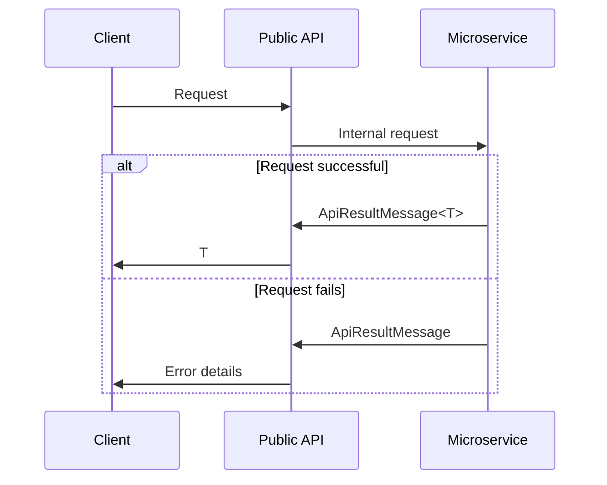

# HiperServiceResultHandler

Simple micro-service result handler.
Provides a framework to streamline communication between front-end end-points (public API) and internal microservices for .NET&nbsp;Core.

## Install

Should be installed both on the public-facing APIs and the internal microservices:

```
Install-Package HiperServiceResultHandler
```

## Framework setup

Communication between front-end and back-end relies on the `ApiResultMessage` class. The class encapsulates data returned by the back-end, but can also contain details about the error in case the microservice raises an exception.



### Middleware

Both microservice and public API servers must install the middleware that handles the transfer of exceptions.
In the microservice server, add the following middleware during startup:

```
app.ConfigureServiceExceptionHandler();
```

While on the public API server, the following:

```
app.ConfigurePublicServiceExceptionHandler();
```

If running the public API in development mode, you may pass in an options object in order to have publicly-readable exceptions in your output:

```
app.ConfigurePublicServiceExceptionHandler(new PublicExceptionMiddleware.Options { DevelopmentMode = true });
```

### Microservice output

In order to prepare your microservice output, you can package up data using extension methods on `ControllerBase`:

```
[HttpGet]
public ActionResult Test() {
    return Result("My test data");
}
```

or any custom type of data:

```
[HttpGet]
public ActionResult Test() {
    return Result(new {
        FieldA = "Test",
        FieldB = 123,
        FieldC = 12.12m
    });
}
```

The examples above produce JSON-serialized outputs following the structure of the `ApiResultMessage` class.

If, at any point, an exception is raised in your microservice code, the error is packaged up into an `ApiResultMessage` result and passed as result.
If you want to pass more information about the error to your public API, you can throw a `ServiceException`, which contains additional fields that can be used to specify details about the error.

### HttpClient communication

When retrieving data from a microservice, you may use one of the generic extensions methods from the `HttpClientExtensions` class, for instance:

```
var http = new HttpClient();
var s = await http.GetAsync<string>("https://host/end-point");
```

This call expects that the target microservice will return a serialized instance of `ApiResultMessage<string>`.
If everything works as intended, the `GetAsync` call will return the string, otherwise an exception is raised, mimicking the error on the microservice-side.

Several `HttpClient` extensions are provided, for different HTTP methods with or without payload (e.g., `PostAsJsonAsync`, `PutAsJsonAsync`, `DeleteAsync`, etc.).
